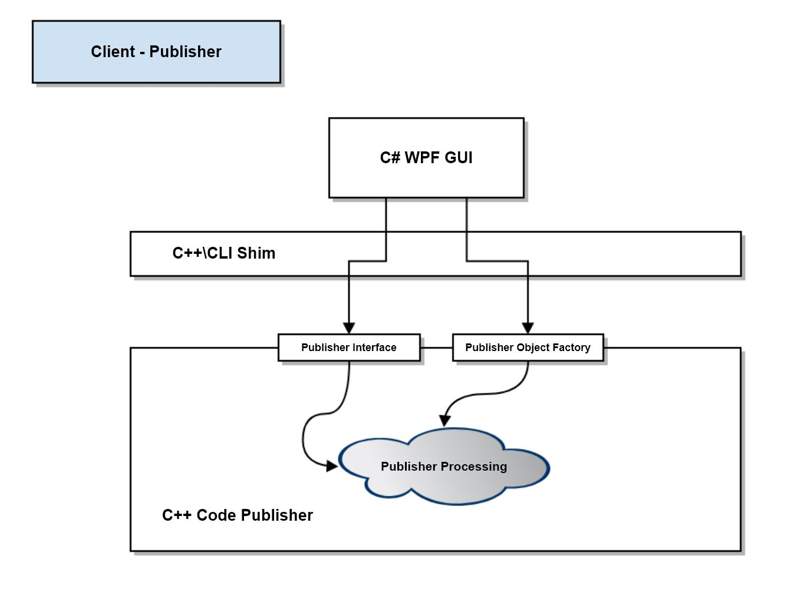

# Remote CodePage Management
> The project Academic project for the course CSE687. It is focused on building tools for software development. There are many state-of-the-art tools like Visual Studio, Gitlab, Github, which does the same but for many big companies, they use the tools of their own. The project provides you the opportunity to practice OOD principles with building big software, it also illustrates some common practice in the industry.

The entire Remote Code Page Management is built in 4 stages and the detailed information is as below
>The package with the name Converter, Display, ServerPrototype and GUI as built by me and rest of the packags was provided as the helper codes for the implementation. The entire Software was developed in 4 months with the effective utilization of the helper codes by the instructor.

##Project Work Flow from Project-1 to Project-4 

##Project #1 - Source Code Publisher 

###Finds and Loads a file for processing:
Files will be loaded when their names match a regular expression. That might be as simple as *.h, but will often be somewhat more complex. You will spend some time getting familiar with the C++11 regex classes. Files that match can be opened with the std::iostream facilities.
###Converts file into a webpage fragment:
That entails creating a new file with the same name, but with an html extension. Contents of the source code file are copied directly to the html file.
Then all html markup characters are replaced with their exscape sequence equivalents, e.g., < is replaced by &lt, etc.
That text is prepended with "<pre>" and postpended with "</pre>". That ensures that the rendered text preserves all of the white space included in the original file.
###Convert html fragment into a valid html document:
This is done by adding template text (from a template file) for a head section and the beginning of the body. Finally a small piece of template code, read from a template file is added to the end of the html fragment text.
At this point the file is viewable in a browser.

##Project #2 - Source Code Publisher for Projects

###Finds and loads files for Processing from a directory tree:
Starting at a path specified on the command line, recursively search each folder in the directory tree rooted at the path, for files with names that match a regular expression. Each matching file is loaded and processed, using the facilities developed in Project #1.
###Records file dependencies for each processed file:
Dependencies will be based on #include statements found in each file. Dependencies are recorded with web links in the constructed web pages. Only #include statements that cite files in the directory tree are recorded with web links.
###Provides facilities for optionally hiding comments and/or function bodies:
The intent is to allow users some flexibility in what is visible. We want to allow users to:
*show or hide comments
*show or hide function bodies
*show just class names by hiding the entire class scope
This can be done by wrapping text that may be hidden with a styled <div>. The hard part is to place the <div>s in appropriate places. To do that you will need to do some relatively simple parsing. We'll give you some help with that.


##Project #3 - Code Publisher Client

###Implement a tabbed display
The Client display will need at least two views, one for navigating to the directory to be analyzed, and one for displaying a published file.
###Navigation view:
The Client's navigation view supports navigating to the directory to be analyzed and supplying a file pattern, used for selecting files to show in the Display view.
###Display view:
The Display view shows a list of converted files for the project and allows the user to display a selected file either as a browser view, or in a pop up window showing the web page source.
This view also allows users to define what is visible. We want to allow users to:
*show or hide comments
*show or hide function bodies
*show just class names by hiding the entire class scope
That will be indicated by checkboxes for each of the above.
###Provide Code Publisher interface
This step replaces the Executive package, from Project #2, with an interface and a class that implements the interface to use Code Publisher's facilities.
###Connect to Code Publisher:
Build a C++\CLI translater to connect the Client GUI to the Code Publisher, built as a dynamic link library. The translater simply delegates function invocations in the GUI to calls into methods in the Code Publisher, using the Publisher's interface.


##Project #4 - Remote Code Page Management

###Implement a communication channel:
The communication channel was provided as the part of the helper code since it required more time to develop since the code consisted of buffer level interaction. 
###Design messages:
You need to design messages for remote operations that mimic what you provided in Project #3. A Message class is provided as part of the communication channel implementation. You simply configure messages with that to trigger remote operations and to retrieve results.
###Develop a server:
A server is needed to accept request messages, and use the Project #2 Code Publisher facility, as modified by Project #3 to carry out publishing operations.
The server needs a message dispatcher that routes messages to the appropriate publication facilities. These diagrams will help you understand what is needed.
###Connect Client to Publisher Server:
Use the C++\CLI translater you built in Project #3 to connect the Client GUI to the Code Publisher Server. That works in a manner very similar to the local connection you made there between Client and your local Code Publisher.

Software details - Developed on Windows:

```sh
Microsoft Visual Studio 2017
```

## Developer info

Ganesh Mamamatha Sheshappa 
ganeshms@live.com

## Instructor
Dr. James W Fawcett
Syracuse University, NY
