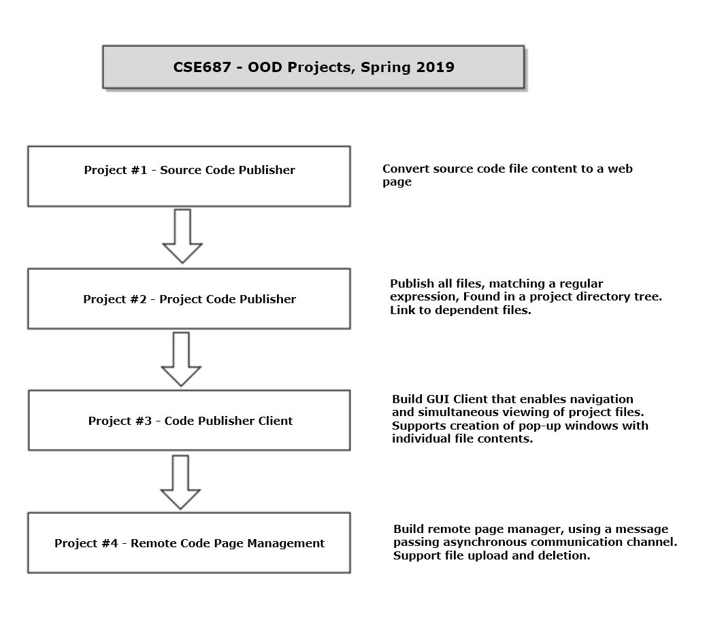

# Remote CodePage Management
> The project is focused on building tools for software development. There are many state-of-the-art tools like Visual Studio, Gitlab, Github, which does the same but for many big companies, they use the tools of their own. The project provides you the opportunity to practice OOD principles with building big software, it also illustrates some common practice in the industry.

One to two paragraph statement about your product and what it does.


##Finds and Loads a file for processing:
Files will be loaded when their names match a regular expression. That might be as simple as *.h, but will often be somewhat more complex. You will spend some time getting familiar with the C++11 regex classes. Files that match can be opened with the std::iostream facilities.
##Converts file into a webpage fragment:
That entails creating a new file with the same name, but with an html extension. Contents of the source code file are copied directly to the html file.
Then all html markup characters are replaced with their exscape sequence equivalents, e.g., < is replaced by &lt, etc.
That text is prepended with "<pre>" and postpended with "</pre>". That ensures that the rendered text preserves all of the white space included in the original file.
##Convert html fragment into a valid html document:
This is done by adding template text (from a template file) for a head section and the beginning of the body4. Finally a small piece of template code, read from a template file is added to the end of the html fragment text.
At this point the file is viewable in a browser.

OS X & Linux:

```sh
npm install my-crazy-module --save
```

Windows:

```sh
edit autoexec.bat
```

## Usage example

A few motivating and useful examples of how your product can be used. Spice this up with code blocks and potentially more screenshots.

_For more examples and usage, please refer to the [Wiki][wiki]._

## Development setup

Describe how to install all development dependencies and how to run an automated test-suite of some kind. Potentially do this for multiple platforms.

```sh
make install
npm test
```

## Release History

* 0.2.1
    * CHANGE: Update docs (module code remains unchanged)
* 0.2.0
    * CHANGE: Remove `setDefaultXYZ()`
    * ADD: Add `init()`
* 0.1.1
    * FIX: Crash when calling `baz()` (Thanks @GenerousContributorName!)
* 0.1.0
    * The first proper release
    * CHANGE: Rename `foo()` to `bar()`
* 0.0.1
    * Work in progress

## Meta

Your Name – [@YourTwitter](https://twitter.com/dbader_org) – YourEmail@example.com

Distributed under the XYZ license. See ``LICENSE`` for more information.

[https://github.com/yourname/github-link](https://github.com/dbader/)

## Contributing

1. Fork it (<https://github.com/yourname/yourproject/fork>)
2. Create your feature branch (`git checkout -b feature/fooBar`)
3. Commit your changes (`git commit -am 'Add some fooBar'`)
4. Push to the branch (`git push origin feature/fooBar`)
5. Create a new Pull Request

<!-- Markdown link & img dfn's -->
[npm-image]: https://img.shields.io/npm/v/datadog-metrics.svg?style=flat-square
[npm-url]: https://npmjs.org/package/datadog-metrics
[npm-downloads]: https://img.shields.io/npm/dm/datadog-metrics.svg?style=flat-square
[travis-image]: https://img.shields.io/travis/dbader/node-datadog-metrics/master.svg?style=flat-square
[travis-url]: https://travis-ci.org/dbader/node-datadog-metrics
[wiki]: https://github.com/yourname/yourproject/wiki
